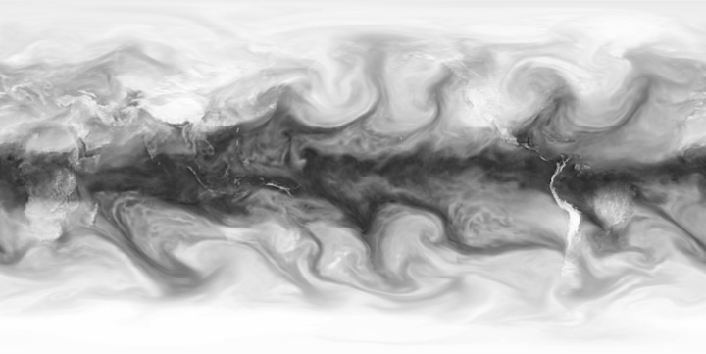
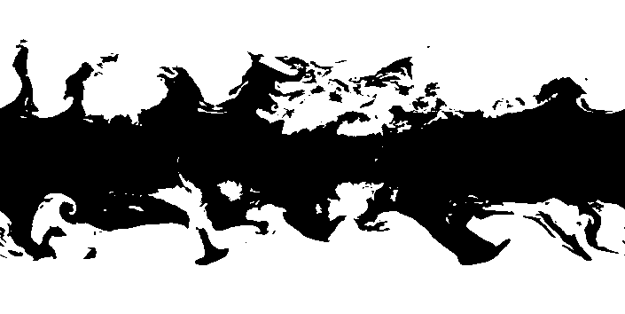
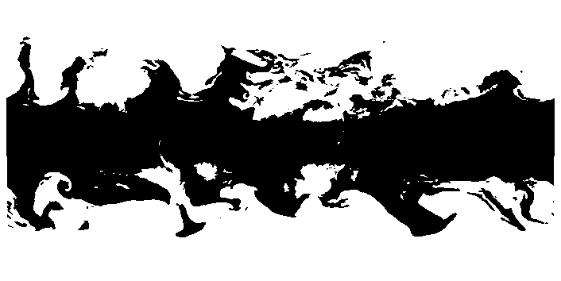
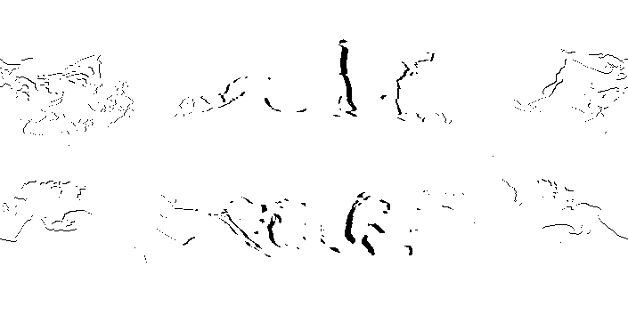
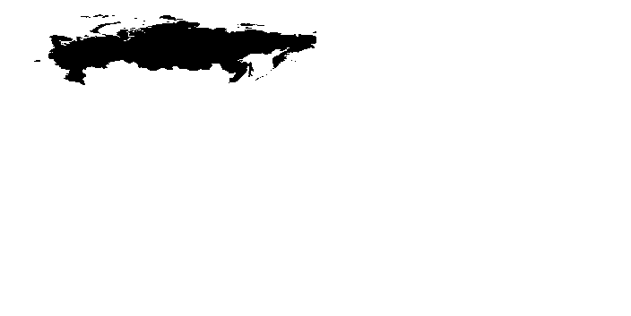
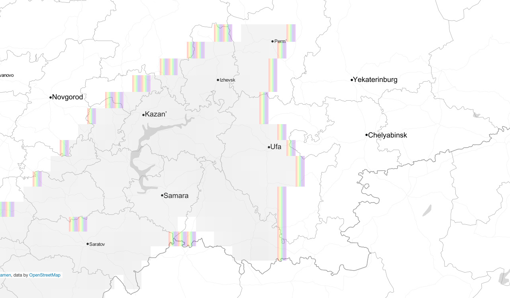

Raduga: server side components
==============================

These are the serverside components for the Raduga app, the app that predicts rainbows over Russia.

It consists of three parts:

- A service to fetch meteorological data, and predict rainbows. 

This is written as a collection of Python scripts, that output JSON files. They are collected in the script [predict.sh][a1].

In general, by running this script every three hours the predictions should stay up to date. One can achieve this by making the script part of a [cronjob][a2].

For a description of how the rainbow prediction works, see below: ‘The rainbow algorithm’

When the scripts run, they log output into a MongoDB database to track progress. If you want to see the output of the various scripts directly into the terminal as you test them, run the following command:

    echo "DEBUG = True" > local_settings.py

- A web service that makes the predictions available to the mobile app

In [app.py][a3], we find a small python web application that provides web-addresses for the rainbow-predictions:

    /latest/elektro-l           redirects to the latest image of elektro l
    /latest/rainbows.json       redirects to the latest series of GEO-json features of rainbows
    /latest/clouds.json         redirects to the latest series of GEO-json features of clouds
    /latest/rainbow_cities.json redirects to a list of cities that are predicted to be in a rainbow zone
    /hq/                        consult a log of the prediction activities

The application uses the [Flask web framework][a4] and can be launched with `python app.py`. Consult the [Flask documentation][a5] on how to host this application on a web server.

- A web service for rainbow spotting photos

In [photos.py][a6], we find a small API for retrieving and posting photos. It is intended for spotting rainbows through the Raduga mobile application.

    /photos/                    JSON feed of photos posted to Raduga

The API uses [Eve][a7], a Python REST API framework based on Flask. It requires Mongodb, and is otherwise hosted in the same way as the rainbow prediction web service.

[a1]: https://github.com/codingisacopingstrategy/raduga-server/blob/master/predict.sh
[a2]: http://en.wikipedia.org/wiki/Cron "Cron - Wikipedia, the free encyclopedia"
[a3]: https://github.com/codingisacopingstrategy/raduga-server/blob/master/app.py
[a4]: http://flask.pocoo.org/ "Welcome | Flask (A Python Microframework)"
[a5]: http://flask.pocoo.org/docs/0.10/deploying/ "Deployment Options &mdash; Flask Documentation (0.10)"
[a6]: https://github.com/codingisacopingstrategy/raduga-server/blob/master/photos.py
[a7]: http://python-eve.org/ "Python REST API Framework &mdash; Eve 0.5-dev documentation"

## License

    Copyright (C) 2014 Eric Schrijver and The Pink Pony Express

    This program is free software: you can redistribute it and/or modify
    it under the terms of the GNU Affero General Public License as published by
    the Free Software Foundation, either version 3 of the License, or
    (at your option) any later version.

    This program is distributed in the hope that it will be useful,
    but WITHOUT ANY WARRANTY; without even the implied warranty of
    MERCHANTABILITY or FITNESS FOR A PARTICULAR PURPOSE.  See the
    GNU Affero General Public License for more details.

    You should have received a copy of the GNU Affero General Public License
    along with this program.  If not, see <http://www.gnu.org/licenses/>.

Consult the source code: <http://github.com/codingisacopingstrategy/raduga-server>

## Dependencies

The server-side components have been tested on Debian 7.

    sudo apt-get update
    # install system-wide dependencies (the jdk+maven is for grib2json):
    sudo apt-get install imagemagick potrace openjdk-7-jdk openjdk-7-jre maven python-imaging
    # install python dependencies
    sudo pip install -r requirements.txt

Then install MongoDB [following their instructions][d1] and install GRIB2JSON [from source][d2].

[d1]: http://docs.mongodb.org/manual/tutorial/install-mongodb-on-debian/ "Install MongoDB on Debian &mdash; MongoDB Manual 2.6.6"
[d2]: https://github.com/cambecc/grib2json

## The rainbow-algorithm

### 1: Find out where it rains

Rainbows need rain and sun. So we need to figure out where is the sun, and where is the rain. Firstly we figure out where it rains.

Even if there are many ways in which meteorologists measure and predict rain, including rain gauges and weather balloons, Radars are one of the most popular means of following the development of rainclouds. In Holland, this fact has entered public consciousness through a popular website called [Buienradar][0]. Specific areas of the earth are well covered by radar. Free sources for such data are available in the [US][1] ([example][2]), [Scandinavia & the Baltic states][3], the [UK][4]. Such a radar network doesn’t exist for Russia: the available Radar sources [cover the main airports][5]. The alternative is to use Satellite data. The first source we tried is EUMETSAT, the European Meteorological Satellites Agency. Their [Multi-Sensor Precipitation Estimate][6] (available [as a Mercator projection][7] as well) proposes ‘Operational weather forecasting in areas with poor or no radar coverage’. The EUMETSAT image doesn’t cover Russia really well though. The European satellites are in a geostationary orbit that always gives them a view of the same slice of earth, and funnily enough that slice does not cover Russia. We wondered if there are historic, old NATO style political reasons for that?

A telephone adventure calling everyone from the KNMI to Meteo-consult to the Finnish Meteorological Agency to the [World Meteorological Organization][8] (Geneva), and they didn’t know where to get data on the Russian clouds. With the help of a translator we contacted the Russian Weather agency. This helped us forward, as they pointed us to their data: [Global medium-range forecast fields in GRIB format][9]. However, until know we had imagined to work with images  This meant using [GRIB][10] data—a data format that while a standard in the world of Meteorological analyses, we did not know how to use directly. Luckily we found a great example in Cameron Beccario’s visualisation called [earth][11]. For this animated map of global wind, weather, and ocean conditions, Beccario not only released the source code, but also added a detailed [README explaining how][12] he gets the source GRIB data and how to read it with a utility developed by him ([GRIB2JSON][13]).

We created a script to download the necessary GRIB files. The details can be found in [fetch.py][14]. There are some 300 different tables in the GFS data, so we ask it to filter for Precipitable Water (PWAT), the information that interests us. The GFS data is produced every six hours. It contains information about the current weather situation and for 3, 6, 9, 12 etc. hours into the future. Because the GFS is not immediately available (in general several hours after the time indicated as ‘now’), we use the predictions of 6 hours and 9 hours into the future. This way we have a time point for every 3 hours.

Now that we have the GRIB data about precipitation, we can get to the next step: processing this data. This happens in the file [water.py][15]. First we convert the GRIB to a JSON file, that we can easily read in with python. As part of this JSON, we have a long list of values that represent the amount of precipitable water for each coordinate on a 0.5 degree grid spanning the earth. This data, we convert into a form that is more easily manipulable still: an image.

Since the GRIB data already provides us with information about the coordinate system, so we can use this to map to an image in a straightforward fashion. We only have to transform the values so they map to the 0-255 range of a grayscale image. From here on we treat the data as an image. An image is just a two-dimensional array, but thinking about the data as an image as opposed to a series of numbers makes it easy to conceptualise the transformations and to show them.

### 2. Find out where the sun is shining

To see a rainbow, one needs to be standing with ones back to the sun, looking in the direction of the raincloud. The sun can not be too high. Water always refracts light in the same way, the angle between the incoming sunlight and the rainbow being 180 minus 42 degrees. Once the sun gets to high (above 42 degrees) the rainbow disappears behind the horizon. That is why you see more rainbows in spring and autumn, as the sun stays lower throughout the day.

For our given point in time, we need to determine where the sun is between 0 en 42 degrees. The first step is to calculate the solar altitudes. This is different for each date, and it is not the same each year. We use the [Pysolar][16] module to do this. We re-use the coordinate system of the precipitation data, we loop over every latitude and longitude combination and ask Pysolar to `GetAltitudeFast(latitude, longitude, DATE)`.

The approach might not be the fastest, but it allows us to easily find the location of the sun (there where the sun is straight overhead the earth): it is the pixel with the highest solar altitude.

We also create a mask, that blacks out all parts where the solar altitude is not between 0 and 42 degrees.

### 3. Find out where the rain meets the sun

Rainbows can appear at the edge of rainclouds. But they can only appear if the rainclouds find themselves in the opposite direction of the sun.

To find these edges, we’ve used the following approach:

- Take the rain-information generated in step 1. Contrast and treshold it as to generate a mask:

- Copy the mask, and slightly extrude it with the position of the sun (found in step 2) as the center point

- Subtract the original clouds from the extrusion

What we have left is the possible position of the rainbows. Then

- Subtract the mask of sun-positions generated in step 2

This gives us all possible rainbow-areas on earth. For the purposes of Радуга, we:

- Mask out Russia

Because at this point we are manipulating images, we can use the Python Imaging Library for this purpose. Except for the extrusion: I couldn’t find out how to use PIL for this so we do it with the classic ImageMagick command line software.

For the areas where the sun is shining, we find the edges of the rainclouds from the center of the sun.

### 4. Propose the rainbows to the world

To make the rainbows visible, we have to encode the pixels that represent rainbow areas so that they can be displayed on an existing map. The layer of the rainbows is projected over another layer, that of the clouds, for which we also know the pixel locations. We do this by encoding them as [GeoJSON][17] features, which is a kind of description that can be visualised easily on popular mapping technologies like Google maps, [d3.js][18] and [leaflet.js][19].

In the app we display the map with the leaflet.js JavaScript library. To get a more austere, black-and-white, look we used the wonderful Open Source map tiles created by Stamen Design called ‘[Toner Lite][20]’.

Initially every pixel was encoded as GeoJSON feature. But it turned out this approach was to heavy: the app had to draw thousands of little squares, especially for the clouds. The solution was to group the pixels together in larger shapes: polygons. We accomplished this with Peter Selinger’s [potrace][21], a command line program that can trace bitmap images into vector shapes. Even if potrace has existed for a long time, quit recently Christoph Hormann [contributed an output module][22] that allows to create GeoJSON directly. Instead of trying to interpolate smooth curves, we configure potrace as to leave the polygons with straight edges.

[0]: http://www.buienradar.nl/ "Buienradar.nl - Weer - Actuele neerslag, weerbericht, weersverwachting, sneeuwradar en satellietbeelden"
[1]: http://mesonet.agron.iastate.edu/ogc/ "IEM :: Open GIS Consortium Web Services"
[2]: http://mesonet.agron.iastate.edu/ogc/googlemaps_v3.html "Google Maps JavaScript API v3 Example: Map Simple"
[3]: http://www.yr.no/kart/#lat=65.00146&amp;lon=19.54158&amp;zoom=3&amp;laga=radar&amp;proj=3575 "Kart – yr.no"
[4]: http://www.metoffice.gov.uk/datapoint/product/rainfall-radar-map-layer "Rainfall radar map layer - Met Office"
[5]: http://meteoinfo.by/radar/
[6]: http://oiswww.eumetsat.org/IPPS/html/MSG/PRODUCTS/MPE/index.htm "EUMETSAT IPPS animation - Meteosat 0 degree Visualised Products Multi-Sensor Precipitation Estimate"
[7]: https://maps.google.be/maps?q=http://oiswww.eumetsat.org/IPPS/html/GE/EUM.kml&amp;output=classic&amp;dg=feature
[8]: https://www.wmo.int/pages/index_en.html
[9]: http://wmc.meteoinfo.ru/Forecast_GRIB "Global medium-range forecast fields in GRIB format"
[10]: http://en.wikipedia.org/wiki/GRIB "GRIB - Wikipedia, the free encyclopedia"
[11]: http://earth.nullschool.net/ "earth :: an animated map of global wind, weather, and ocean conditions"
[12]: https://github.com/cambecc/earth#getting-weather-data
[13]: https://github.com/cambecc/grib2json
[14]: https://github.com/codingisacopingstrategy/raduga-server/blob/master/fetch.py
[15]: https://github.com/codingisacopingstrategy/raduga-server/blob/master/water.py
[16]: http://pysolar.org/ "Pysolar: staring directly at the sun since 2007"
[17]: http://geojson.org/ "GeoJSON"
[18]: http://d3js.org/
[19]: http://leafletjs.com/ "Leaflet - a JavaScript library for mobile-friendly maps"
[20]: http://maps.stamen.com/toner-lite/#16/48.8592/2.3703 "maps.stamen.com / toner-lite"
[21]: http://potrace.sourceforge.net/ "Peter Selinger: Potrace"
[22]: http://blog.imagico.de/new-potrace-version-with-geojson-backend/ "new potrace version with GeoJSON backend | Imagico.de"

